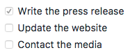

:tip-caption:
[#_extended_syntax]
= Extended Syntax

emoji:heart[1x]

emoji:bulb[1x] emoji:bulb[2x]

Advanced features that build on the basic Markdown syntax.

== Overview

The https://www.markdownguide.org/basic-syntax[basic syntax] outlined in
the original Markdown design document added many of the elements needed
on a day-to-day basis, but it wasn't enough for some people. That's
where extended syntax comes in.

Several individuals and organizations took it upon themselves to extend
the basic syntax by adding additional elements like tables, code blocks,
syntax highlighting, URL auto-linking, and footnotes. These elements can
be enabled by using a lightweight markup language that builds upon the
basic Markdown syntax, or by adding an extension to a compatible
Markdown processor.

== Availability

Not all Markdown applications support extended syntax elements. You'll
need to check whether or not the lightweight markup language your
application is using supports the extended syntax elements you want to
use. If it doesn't, it may still be possible to enable extensions in
your Markdown processor.

=== Lightweight Markup Languages

There are several lightweight markup languages that are _supersets_ of
Markdown. They include basic syntax and build upon it by adding
additional elements like tables, code blocks, syntax highlighting, URL
auto-linking, and footnotes. Many of the most popular Markdown
applications use one of the following lightweight markup languages:

* https://commonmark.org[CommonMark]
* https://github.github.com/gfm/[GitHub Flavored Markdown (GFM)]
* https://michelf.ca/projects/php-markdown/extra/[Markdown Extra]
* https://fletcherpenney.net/multimarkdown/[MultiMarkdown]
* https://rmarkdown.rstudio.com/[R Markdown]

=== Markdown Processors

There are
https://github.com/markdown/markdown.github.com/wiki/Implementations[dozens
of Markdown processors] available. Many of them allow you to add
extensions that enable extended syntax elements. Check your processor's
documentation for more information.

== Tables

To add a table, use three or more hyphens (`---`) to create each
column's header, and use pipes (`|`) to separate each column. For
compatibility, you should also add a pipe on either end of the row.

[source,adoc]
----
  [cols=",",options="header",]
  |===
  |Syntax    |Description
  |Header    |Title
  |Paragraph |Text
  |===
----

The rendered output looks like this:

[cols=",",options="header",]
|===
|Syntax    |Description
|Header    |Title
|Paragraph |Text
|===

Cell widths can vary, as shown below. The rendered output will look the
same.

[source,adoc]
----
  cols=",",options="header",]
  |===
  |Syntax |Description
  |Header |Title
  |Paragraph |Text
  |===
----


.emoji:bulb[] *Tip*
[caption=""]
====
Creating tables with hyphens and pipes can be tedious. To speed up the process, try using the https://www.tablesgenerator.com/markdown_tables[Markdown Tables
Generator] or https://anywaydata.com[AnyWayData Markdown Export]. Build a table using the graphical interface, and then copy the generated Markdown-formatted text into your file.
====

=== Alignment

You can align text in the columns to the left, right, or center by
adding a colon (`:`) to the left, right, or on both side of the hyphens
within the header row.

[source,adoc]
----
  [cols="<,^,>",options="header",]
  |===
  |Syntax |Description |Test Text
  |Header |Title |Here's this
  |Paragraph |Text |And more
  |===
----

The rendered output looks like this:

[cols="<,^,>",options="header",]
|===
|Syntax |Description |Test Text
|Header |Title |Here's this
|Paragraph |Text |And more
|===

=== Formatting Text in Tables

You can format the text within tables. For example, you can add
https://www.markdownguide.org/basic-syntax/#links[links],
https://www.markdownguide.org/basic-syntax/#code-1[code] (words or
phrases in backticks (```) only, not
https://www.markdownguide.org/basic-syntax/#code-blocks[code blocks]),
and https://www.markdownguide.org/basic-syntax/#emphasis[emphasis].

You can't use headings, blockquotes, lists, horizontal rules, images, or
most HTML tags.

.emoji:bulb[] *Tip:*
[caption=""]
====
 You can use HTML to create https://www.markdownguide.org/hacks/#line-breaks-within-table-cells[line breaks] and add https://www.markdownguide.org/hacks/#lists-within-table-cells[lists] within table cells.
====

=== Escaping Pipe Characters in Tables

You can display a pipe (`|`) character in a table by using its HTML
character code (`&#124;`).

== Fenced Code Blocks

The basic Markdown syntax allows you to create
https://www.markdownguide.org/basic-syntax#code-blocks[code blocks] by
indenting lines by four spaces or one tab. If you find that
inconvenient, try using fenced code blocks. Depending on your Markdown
processor or editor, you'll use three backticks (`\`\`\``) or three
tildes (`~~~`) on the lines before and after the code block. The best
part? You don't have to indent any lines!

[source,json]
----
  [source]
  ----
  {
    "firstName": "John",
    "lastName": "Smith",
    "age": 25
  } 
  ----
----

The rendered output looks like this:

[source]
----
  {
    "firstName": "John",
    "lastName": "Smith",
    "age": 25
  } 
----

.emoji:bulb[] *Tip:*
[caption=""]
====
Need to display backticks inside a code block? See https://www.markdownguide.org/basic-syntax/#escaping-backticks[this section] to learn how to escape them.
====

=== Syntax Highlighting

Many Markdown processors support syntax highlighting for fenced code
blocks. This feature allows you to add color highlighting for whatever
language your code was written in. To add syntax highlighting, specify a
language next to the backticks before the fenced code block.

[source,json]
----
  [source,json]
  ----
  { 
    "firstName": "John", 
    "lastName": "Smith", 
    "age": 25 
  } 
  ----
----

The rendered output looks like this:

[source,json]
----
  { 
    "firstName": "John", 
    "lastName": "Smith", 
    "age": 25 
  } 
----

== Footnotes

Footnotes allow you to add notes and references without cluttering the
body of the document. When you create a footnote, a superscript number
with a link appears where you added the footnote reference. Readers can
click the link to jump to the content of the footnote at the bottom of
the page.

To create a footnote reference, add a caret and an identifier inside
brackets (`[^1]`). Identifiers can be numbers or words, but they can't
contain spaces or tabs. Identifiers only correlate the footnote
reference with the footnote itself — in the output, footnotes are
numbered sequentially.

Add the footnote using another caret and number inside brackets with a
colon and text (`[^1]: My footnote.`). You don't have to put footnotes
at the end of the document. You can put them anywhere except inside
other elements like lists, block quotes, and tables.

[source,adoc]
----
Here's a simple footnote,footnote:[This is the first footnote.] and
here's a longer one.footnote:[pass:a,p[Here's one with multiple paragraphs and code. +
Indent paragraphs (with 4 spaces) to include them in the footnote. +
{blank} +
  `{ my code }` +
{blank} +
Add as many paragraphs as you like.]] 
This is third variant.footnote:[Here's one with multiple paragraphs and code.pass:p[ +]
Indent paragraphs (with 4 spaces) to include them in the footnote.pass:p[ +]
pass:p[ +]
  `{ my code }` pass:p[ +]
pass:p[ +]
Add as many paragraphs as you like.]
----

The rendered output looks like this:

Here's a simple footnote,footnote:[This is the first footnote.] and
here's a longer one.footnote:[pass:a,p[Here's one with multiple paragraphs and code. +
Indent paragraphs (with 4 spaces) to include them in the footnote. +
{blank} +
  `{ my code }` +
{blank} +
Add as many paragraphs as you like.]] 
This is third variant.footnote:[Here's one with multiple paragraphs and code.pass:p[ +]
Indent paragraphs (with 4 spaces) to include them in the footnote.pass:p[ +]
pass:p[ +]
  `{ my code }` pass:p[ +]
pass:p[ +]
Add as many paragraphs as you like.]

== Heading IDs

Many Markdown processors support custom IDs for
https://www.markdownguide.org/basic-syntax/#headings[headings] — some
Markdown processors automatically add them. Adding custom IDs allows you
to link directly to headings and modify them with CSS. To add a custom
heading ID, enclose the custom ID in curly braces on the same line as
the heading.

[source,adoc]
----
=== My Great Heading
----

The HTML looks like this:

[source,html]
----
<h3 id="custom-id">My Great Heading</h3> 
----

=== Linking to Heading IDs

You can link to headings with custom IDs in the file by creating a
link:https://www.markdownguide.org/basic-syntax/#links[standard link] with a
number sign (`#`) followed by the custom heading ID. These are commonly
referred to as _anchor links_.

[width="100%",cols="34%,33%,33%",options="header",]
|===
|AsciiDoc |HTML |Rendered Output
|`+link:#heading-ids[Heading IDs]+` |`<a href="#heading-ids">Heading IDs</a>`
|link:#heading-ids[Heading IDs]
|===

Other websites can link to the heading by adding the custom heading ID
to the full URL of the webpage (e.g,
`[Heading IDs](https://www.markdownguide.org/extended-syntax#heading-ids)`).

== Definition Lists

Some Markdown processors allow you to create _definition lists_ of terms
and their corresponding definitions. To create a definition list, type
the term on the first line. On the next line, type a colon followed by a
space and the definition.

[source,adoc]
----
First Term +
  This is the definition of the first term.

Second Term +
  This is one definition of the second term. +
  This is another definition of the second term.
----

The HTML looks like this:

[source,html]
----
<dl>
  <dt>First Term</dt>
  <dd>This is the definition of the first term.</dd>
  <dt>Second Term</dt>
  <dd>This is one definition of the second term. </dd>
  <dd>This is another definition of the second term.</dd>
</dl> 
----

The rendered output looks like this:

First Term +
  This is the definition of the first term.

Second Term +
  This is one definition of the second term. +
  This is another definition of the second term.

== Strikethrough

You can strikethrough words by putting a horizontal line through the
center of them. The result looks [line-through]*like this*. This feature
allows you to indicate that certain words are a mistake not meant for
inclusion in the document. To strikethrough words, use two tilde symbols
(`~~`) before and after the words.

[source,adoc]
----
~~The world is flat.~~ We now know that the world is round. 
----

The rendered output looks like this:

[line-through]*The world is flat.* We now know that the world is round.

== Task Lists

Task lists (also referred to as _checklists_ and _todo_ lists) allow you
to create a list of items with checkboxes. In Markdown applications that
support task lists, checkboxes will be displayed next to the content. To
create a task list, add dashes (`-`) and brackets with a space (`[ ]`)
in front of task list items. To select a checkbox, add an `x` in between
the brackets (`[x]`).

[source,adoc]
----
* [x] Write the press release
* [ ] Update the website
* [ ] Contact the media 
----

The rendered output:

* [x] Write the press release
* [ ] Update the website
* [ ] Contact the media

The rendered output must look like this::



== Emoji

There are two ways to add emoji to Markdown files: copy and paste the
emoji into your Markdown-formatted text, or type _emoji shortcodes_.

=== Copying and Pasting Emoji

In most cases, you can simply copy an emoji from a source like
https://emojipedia.org/[Emojipedia] and paste it into your document.
Many Markdown applications will automatically display the emoji in the
Markdown-formatted text. The HTML and PDF files you export from your
Markdown application should display the emoji.

.emoji:bulb[] *Tip:*
[TIP]
====
If you're using a static site generator, make sure you https://www.w3.org/International/tutorials/tutorial-char-enc/[encode HTML pages as UTF-8].
====

=== Using Emoji Shortcodes

Some Markdown applications allow you to insert emoji by typing emoji
shortcodes. These begin and end with a colon and include the name of an
emoji.

[source,adoc]
----
Gone camping! emoji:tent[] Be back soon.

That is so funny! emoji:joy[] 
----

The rendered output looks like this:

Gone camping! emoji:tent[] Be back soon.

That is so funny! emoji:joy[]

.emoji:bulb[] *Note:*
[NOTE]
====
ℹ️ *Note:* You can use this
https://gist.github.com/rxaviers/7360908[list of emoji shortcodes], but
keep in mind that emoji shortcodes vary from application to application.
Refer to your Markdown application's documentation for more information.
====

== Highlight

This isn't common, but some Markdown processors allow you to highlight
text. The result looks #like this#. To highlight words, use hash
signs (`#`) before and after the words.

[source,adoc]
----
I need to highlight these #very important words#. 
----

The rendered output looks like this:

I need to highlight these #very important words#.

Alternatively, if your Markdown application supports
https://www.markdownguide.org/basic-syntax/#html[HTML], you can use the
`mark` HTML tag.

[source,html]
----
I need to highlight these <mark>very important words</mark>. 
----

== Subscript

This isn't common, but some Markdown processors allow you to use
_subscript_ to position one or more characters slightly below the normal
line of type. To create a subscript, use one tilde symbol (`~`) before
and after the characters.

[source,adoc]
----
H~2~O 
----

The rendered output looks like this:

H~2~O


====
emoji:bulb[] *Tip:* Be sure to test this in your
Markdown application before using it. Some Markdown applications use one
tilde symbol before and after words not for subscript, but for
https://www.markdownguide.org/extended-syntax/#strikethrough[strikethrough].
====

Alternatively, if your Markdown application supports
https://www.markdownguide.org/basic-syntax/#html[HTML], you can use the
`sub` HTML tag.

[source,html]
----
H<sub>2</sub>O 
----

== Superscript

This isn't common, but some Markdown processors allow you to use
_superscript_ to position one or more characters slightly above the
normal line of type. To create a superscript, use one caret symbol (`^`)
before and after the characters.

[source,adoc]
----
X^2^ 
----

The rendered output looks like this:

X^2^

Alternatively, if your Markdown application supports
https://www.markdownguide.org/basic-syntax/#html[HTML], you can use the
`sup` HTML tag.

[source,html]
----
X<sup>2</sup> 
----

== Automatic URL Linking

Many Markdown processors automatically turn URLs into links. That means
if you type http://www.example.com, your Markdown processor will
automatically turn it into a link even though you haven't
https://www.markdownguide.org/basic-syntax/#links[used brackets].

[source,adoc]
----
http://www.example.com 
----

The rendered output looks like this: http://www.example.com

== Disabling Automatic URL Linking

If you don't want a URL to be automatically linked, you can remove the
link by https://www.markdownguide.org/basic-syntax/#code[denoting the
URL as code] with a backticks.

[source,adoc]
----
`\http://www.example.com`
----

The rendered output looks like this:

\http://www.example.com

Another way to prevent automatic linking of a URL or email address is to turn off the macros substitution using incremental subs:

[source,adoc]
----
[subs=-macros]
Once launched, the site will be available at https://example.org.
----

Rendered output:

[subs=-macros]
Once launched, the site will be available at https://example.org.


* <<_extended_syntax>>
** <<_overview>>
** <<_availability>>
*** <<_lightweight_markup_languages>>
*** <<_markdown_processors>>
** <<_tables>>
*** <<_alignment>>
*** <<_formatting_text_in_tables>>
*** <<_escaping_pipe_characters_in_tables>>
** <<_fenced_code_blocks>>
*** <<_syntax_highlighting>>
** <<_footnotes>>
** <<_heading_ids>>
*** <<_linking_to_heading_ids>>
** <<_definition_lists>>
** <<_strikethrough>>
** <<_task_lists>>
** <<_emoji>>
*** <<_copying_and_pasting_emoji>>
*** <<_using_emoji_shortcodes>>
** <<_highlight>>
** <<_subscript>>
** <<_superscript>>
** <<_automatic_url_linking>>
** <<_disabling_automatic_url_linking>>
